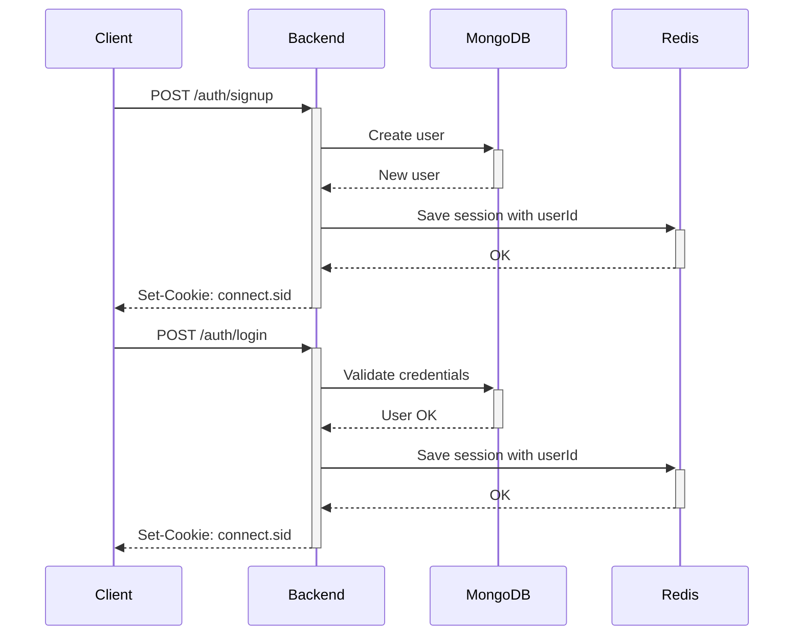
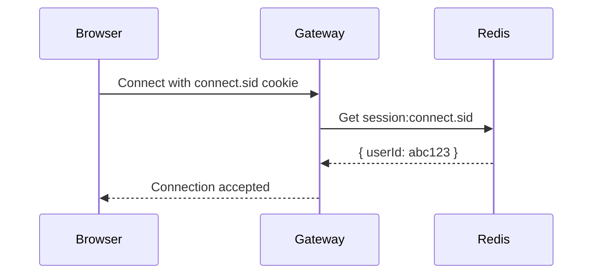

# Authentication & Authorization

Campus Connect implements session-based authentication using a combination of MongoDB for user records and Redis for session storage. The system is secure, stateless on the backend, and designed to support both HTTP and WebSocket authentication flows.


---

## Overview

Authentication: verifies the identity of users (login/signup + session).

Authorization: determines whether an authenticated user has permission to perform a given action (e.g., access channel, edit message, etc).

Implemented via:

- Session cookies (`connect.sid`)
- Encrypted Redis session store
- Guards (`AuthGuard`, `ChannelsGuard`)
- Decorators like `@CurrentUser()`
- Explicit user access logic (e.g., `channel.participants.includes(userId)`)

---

## Auth Flow



---

## Session Lifecycle

- Managed via express-session with Redis backend
- Sessions are:
    - Signed with `SESSION_SECRET`
    - Encrypted with AES-256
    - Expire after 1 day (configurable via TTL)

Each session is stored in Redis with key format: `session:{sessionId}`

---

## Middleware & Guards

### Session Middleware

Parses and attaches session data to each request.

```ts title="session.middleware.ts"
req.session.userId = userId;
```

### AuthGuard

Used to protect any route that requires login.

```ts title="auth.guard.ts"
return Boolean(request.session && request.session.userId);
```

### ChannelsGuard

Used for routes requiring channel-level access.

- Rejects requests if `channelId` not associated with `userId`
- Bypasses certain open routes (like getDMChannel)

```ts title="channels.guard.ts"
if (!channel.participants.includes(userId)) throw new ForbiddenException();
```

---

## Auth Decorator

### `@CurrentUser()`

Extracts user ID from session.

Used in controller methods to avoid manually accessing `req.session`.

```ts title="auth/current-user.decorator.ts"
return request.session ? request.session.userId || null : null;
```

---

## Protected Routes

```ts title="auth.controller.ts"
@UseGuards(AuthGuard)
@Get('profile')
getProfile(@CurrentUser() userId: string) {
  ...
}
```

---

## Login / Signup API

### POST `/auth/signup`

Creates a user and starts a session.

```json
{
  "email": "alice@school.edu",
  "username": "alice123",
  "password": "securepass",
  "campus": "West"
}
```

### POST `/auth/login`

Logs in and saves session with `userId`.

```json
{
  "identifier": "alice123",  // email, username, or id
  "password": "securepass"
}
```

### POST `/auth/logout`

Destroys session by deleting from Redis.

### GET `/auth/session`

Returns `{ userId }` if session is valid.

---

## WebSocket Authentication



Validation is done during `handleConnection`:

```ts
const session = await sessionService.getSessionFromRawCookie(rawCookie);
if (!session?.userId) client.disconnect();
```

---

## Authorization Logic

Campus Connect does **not** use roles/permissions currently.

Instead, all authorization is enforced manually:

- Channels:
    - Must be participant to read, write, or fetch messages
- Messages:
    - Can only edit/delete if `senderId === userId`
- Friends:
    - Cannot send requests to self
    - Cannot block users already blocked

Example:

```ts title="channels.guard.ts"
if (!channel.participants.includes(userId)) {
  throw new ForbiddenException('You are not a participant of this channel.');
}
```

---

## Password Handling

Passwords are **never** stored in plaintext.

- Hashing: `bcrypt.hash(password, 10)`
- Verification: `bcrypt.compare(input, storedHash)`

```ts title="users.service.ts"
if (!(await comparePasswords(password, user.password))) {
  throw new UnauthorizedException();
}
```