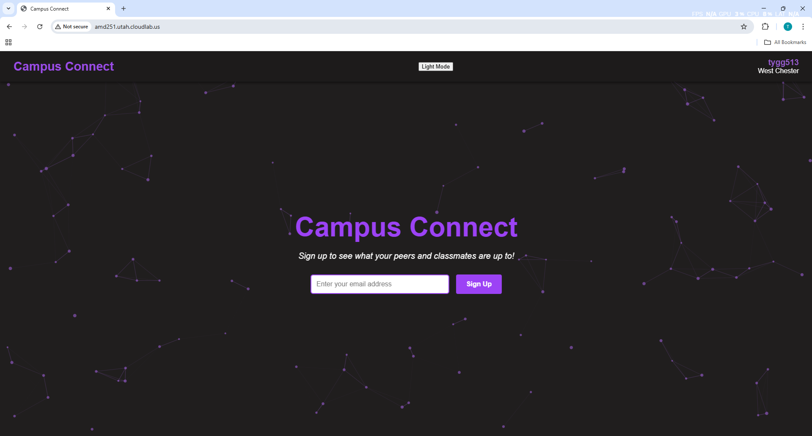

# Campus Connect Documentation

**Course:** CSC 468 – Cloud Computing  
**Institution:** West Chester University  
**Semester:** Spring 2025

---

## Members (Alphabetical Order)

- Perez Abhuilmen  
- Alex Cooper  
- Tyler Geiger  
- Kadin Matotek  

---

## Project Demo

  <iframe src="https://github.com/user-attachments/assets/d7283bc3-de12-4958-9480-3497b9364b9b" width="100%" height="400" allowfullscreen loading="lazy"></iframe>
  <iframe src="https://github.com/user-attachments/assets/c5edbe7b-390c-4f24-ac6f-0c3e094eccee" width="100%" height="400" allowfullscreen loading="lazy"></iframe>

---

## Vision

Our vision is to create an application tailored for university students that enables them to:

- Connect with peers on campus  
- Collaborate on class projects  
- Study and chat together in real time  

Campus Connect offers a clean, minimal interface inspired by platforms like Discord, but focused specifically on **academic connections and collaboration**.

---

## Overview

Campus Connect is a full-stack, real-time chat platform built to enhance campus communication and productivity. Our system is designed to offer:

- Private messaging and group chats
- Friend system with request handling
- Secure session management with Redis
- WebSocket-powered live messaging
- Modular architecture with full CI/CD pipeline

---

## Technology Stack

- **Backend**: NestJS, TypeScript, MongoDB (Mongoose), Redis, Express Sessions  
- **Frontend**: ReactJS (served statically via Nginx)  
- **Real-time**: Socket.IO for live messaging  
- **Security**: AES-256-CBC encrypted sessions, AuthGuard protection, bcrypt password hashing  
- **CI/CD**: GitHub webhook → CloudLab Portal API → Skaffold → Helm → Kubernetes (Minikube)  
- **Secrets Management**: Helm-managed values.yaml for sensitive keys and Docker build args  

---

## Features & TODO List

### 1. Authentication & Authorization
- [x] User registration and login endpoints  
- [x] Session management with encrypted Redis store  
- [x] AuthGuard for protected routes  
- [x] Password hashing and verification  
- [ ] (Idea?) Email verification and password reset support  

---

### 2. Friend System
- [x] Friend request model with statuses (pending, accepted, declined)  
- [x] Extended user schema for friend tracking  
- [x] API to send/accept/decline friend requests  
- [x] Endpoint to fetch confirmed friends list  
- [x] Blocklist handling in schema  
- [x] Basic UI to manage friend requests  
- [x] Real-time friend request notifications 
- [ ] Notifications rendered on frontend    

---

### 3. Direct Messaging
- [x] Create & retrieve DM channel between users  
- [x] Design message schema (content, sender, timestamp)  
- [x] WebSocket event on message send  
- [ ] Load & persist message history  
- [ ] Input box and infinite scroll UI  

---

### 4. Live Messaging (Socket.IO)
- [x] Gateway for `/channels` namespace  
- [x] EventEmitter-driven real-time broadcasting  
- [x] UI listens to `messageReceived` events  
- [ ] Automatically join/leave channel rooms via WebSocket events  
- [ ] Sync unread message indicators  

---

### 5. University Group Chat
- [x] Group channel model (reusing base channel schema)  
- [ ] Add group metadata (title, description, creator)  
- [ ] Join/leave endpoints for university-based channels  
- [ ] Manage group participants  
- [ ] Extend live messaging to group channels  

---

### 6. Classroom & Subgroups
- [ ] Define classroom group and nested subgroup schema  
- [ ] Support roles: student, instructor, TA  
- [ ] Channel-specific permissions for moderation  
- [ ] Role-based message visibility and muting  
- [ ] Admin UI to manage members and roles  

---

### 7. Secrets & CI/CD
- [x] Helm values.yaml for managing encryption key, Redis URI, session secret  
- [x] Skaffold handles builds for frontend/backend separately  
- [x] GitHub webhook → shell script triggers Skaffold deploy  
- [x] CloudLab Portal API triggers Minikube pod rollout  
- [ ] Add secret syncing between dev/prod clusters  
- [ ] Monitor builds and auto-fail bad deploys  

---

## Summary

Campus Connect is not just a messaging platform — it's a collaborative academic tool designed for students, by students. With full-stack ownership, real-time architecture, and secure deployment, it offers a scalable foundation for academic communities and class groups to communicate, share, and succeed.
