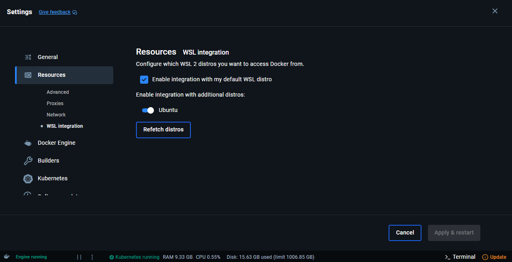

## 1. Requirements

Before starting the deployment, ensure you have the following tools installed and configured:

| Tool          | Description                                      | Install Link |
|---------------|--------------------------------------------------|--------------|
| **Docker Desktop** | Containerization platform for local development. | [Install Docker](https://www.docker.com/products/docker-desktop) |
| **Minikube**       | Run a local Kubernetes cluster.                | [Install Minikube](https://minikube.sigs.k8s.io/docs/start/) |
| **Skaffold**       | Automate the build and deployment cycle.       | [Install Skaffold](https://skaffold.dev/docs/install/) |
| **kubectl**        | Interact with the Kubernetes cluster.          | [Install kubectl](https://kubernetes.io/docs/tasks/tools/) |
| **Helm**           | Manage and deploy Kubernetes packages.         | [Install Helm](https://helm.sh/docs/intro/install/) |

??? warning "Docker Desktop Setup on Windows"
    If you're using **Docker on Windows**, follow these steps:
    
    1. Open **Docker Desktop**.
    2. Go to **Settings > Resources > WSL Integration**.
    3. Enable **“Integration with my default WSL distro”**.
    4. Check Ubuntu under *"Enable integration with additional distros:"*
    5. Click **Apply and Restart** to apply your changes.

    
    
---

## 2. Local Deployment 

The scripts `install_deps.sh` and `startup.sh` in `/deploy_scripts` are designed for deployment in a CI/CD pipeline on a linux environment like CloudLab. These can be referenced here.

### Step 1: Start Minikube

Open a new WSL terminal in the project root, and start the Kubernetes cluster using Minikube with Docker as the driver:

```bash
minikube start --driver=docker
```

### Step 2: Enable the NGINX Ingress Addon

Enable the ingress addon to manage external traffic:

```bash
minikube addons enable ingress
```

This command installs the NGINX ingress controller that will handle routing HTTP requests into the Kubernetes cluster.

### Step 3: Patch the Ingress Controller

Patch the ingress controller’s service to change its type to `LoadBalancer` so that it can be accessed externally:

```bash
kubectl patch svc ingress-nginx-controller 
    -n ingress-nginx 
    -p '{"spec": {"type": "LoadBalancer"}}'
```

!!! note  
    By default, the NGINX Ingress controller is exposed as a `ClusterIP` service, which is only reachable from within the cluster. Patching it to `LoadBalancer` changes the service type to expose a network-accessible IP address.


### Step 4: Start the Minikube Tunnel

Run the tunnel to expose LoadBalancer services on your host network:

```bash
minikube tunnel
```

!!! warning
    Keep this terminal open because the tunnel is active only while the terminal is running. You should create a new terminal for the next steps or run `minikube tunnel` in a standalone terminal. 

### Step 5: Deploy with Skaffold (Development Profile)

For local development, use the `dev` profile to set the hostname to `localhost`:

```bash
skaffold run -p dev
```
